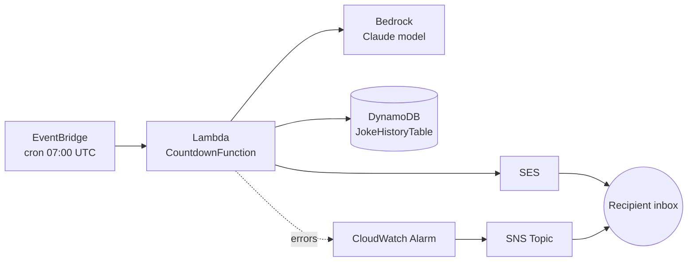

# retirement-calleth

A serverless AWS application that emails a daily retirement countdown, complete
with an AI-generated joke that gets progressively more unhinged as the date
approaches. Built with AWS CDK (TypeScript).

Every morning at 07:00 UTC, a Lambda function calculates the number of days
left until a configured retirement date, asks Amazon Bedrock (Claude) for a
short joke matching the mood of that countdown stage, and emails the result
via Amazon SES. Recent jokes are kept in DynamoDB so the model avoids
repeating itself, and a CloudWatch alarm emails a separate ops alert if a run
fails.

## Architecture



See [docs/architecture.md](docs/architecture.md) for a full component
breakdown, [docs/well-architected-review.md](docs/well-architected-review.md)
for an AWS Well-Architected Framework review, and
[docs/threat-model.md](docs/threat-model.md) for a STRIDE threat model.

## Project layout

```
bin/retirement-countdown.ts        CDK app entry point + stack configuration
lib/retirement-countdown-stack.ts  CDK stack: Lambda, EventBridge, DynamoDB, SES IAM, alarms
lambda/handler.ts                  Lambda handler: countdown, Bedrock joke, SES send, DynamoDB history
```

## Before deploying

1. **Edit `bin/retirement-countdown.ts`** — set `retirementDate`,
   `senderEmail`, `recipientEmail`, and (optionally) `bedrockModelId`.

2. **Verify SES identities.** In a new/sandboxed SES account, both the
   sender and recipient addresses must be verified:
   ```bash
   aws ses verify-email-identity --email-address your-verified-sender@example.com
   aws ses verify-email-identity --email-address your-recipient@example.com
   ```
   Check your inbox for the verification links. (Request SES production
   access if you want to skip recipient verification later.)

3. **Enable Bedrock model access.** In the AWS Console → Bedrock → Model
   access, request access to the Claude model you set as `bedrockModelId`.
   This is a one-time, per-account/region approval.

## Deploy

```bash
npm install
npx cdk bootstrap   # first time only, per account/region
npx cdk deploy
```

## Test it immediately

```bash
aws lambda invoke --function-name <CountdownFunctionName-from-stack-output> out.json
cat out.json
```

## Notes

- **DST**: the schedule is fixed at 07:00 UTC (08:00 BST / 07:00 GMT). It
  won't auto-shift with daylight saving — adjust the cron in
  `lib/retirement-countdown-stack.ts` if exact local time matters year-round.
- **Joke history**: stored in DynamoDB so the prompt can tell Bedrock what
  to avoid repeating. Per-day records expire after 90 days (TTL).
- **Alerts**: a CloudWatch alarm on Lambda errors emails the recipient
  address separately if a run fails, so a silent break doesn't go unnoticed.
- **Cost**: this is comfortably within AWS free tier for a single daily
  invocation — Lambda, EventBridge, and DynamoDB costs are negligible.
  Bedrock and SES have small per-use costs (fractions of a cent/day).

## Tear down

```bash
npx cdk destroy
```
