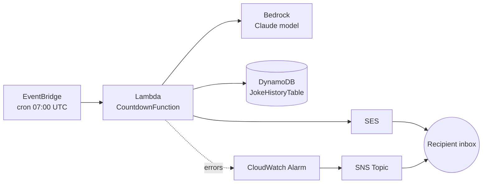

# retirement-calleth


A serverless AWS application that emails a daily retirement countdown, complete
with an AI-generated joke that gets progressively more unhinged as the date
approaches. Built with AWS CDK (TypeScript).

Every morning at 07:00 UTC, a Lambda function calculates the number of
**working days** left until a configured retirement date, asks Amazon
Bedrock (Claude) for a short joke matching the mood of that countdown
stage, and emails the result via Amazon SES. Recent jokes are kept in
DynamoDB so the model avoids repeating itself, and a CloudWatch alarm
emails a separate ops alert if a run fails.

"Working days" excludes weekends, England & Wales bank holidays, the
Christmas Day–New Year's Day closure period, and a fortnightly non-working
Friday — see [docs/architecture.md](docs/architecture.md#working-day-calculation)
for the exact rules.

## Architecture



See [docs/architecture.md](docs/architecture.md) for a full component
breakdown, [docs/well-architected-review.md](docs/well-architected-review.md)
for an AWS Well-Architected Framework review, and
[docs/threat-model.md](docs/threat-model.md) for a STRIDE threat model.

## Project layout

```
bin/retirement-countdown.ts        CDK app entry point + stack configuration
lib/retirement-countdown-stack.ts  CDK stack: Lambda, EventBridge, DynamoDB, SES IAM, alarms
lambda/handler.ts                  Lambda handler: countdown, Bedrock joke, SES send, DynamoDB history
lambda/workingDays.ts              UK bank holidays, Christmas closure, fortnightly Friday, day counting
lambda/email.ts                    Countdown stage/tone, progress bar, HTML + text email rendering
```

## Before deploying

1. **Verify SES identities.** In a new/sandboxed SES account, both the
   sender and recipient addresses must be verified:
   ```bash
   aws ses verify-email-identity --email-address your-verified-sender@example.com
   aws ses verify-email-identity --email-address your-recipient@example.com
   ```
   Check your inbox for the verification links. (Request SES production
   access if you want to skip recipient verification later.)

2. **Enable Bedrock model access.** In the AWS Console → Bedrock → Model
   access, request access to the Claude model set as `bedrockModelId` in
   `bin/retirement-countdown.ts` (hardcoded, since it's not personal data).
   This is a one-time, per-account/region approval.

## Deploy

`retirementDate`, `senderEmail`, `recipientEmail`, and
`nonWorkingFridayAnchor` are **not** hardcoded — they're personal data, so
they must be passed as CDK context on every `deploy`/`synth`/`destroy`
invocation instead of being committed to source. `nonWorkingFridayAnchor`
is the ISO date of *any* Friday you know you don't work — it anchors the
fortnightly on/off pattern (see
[docs/architecture.md](docs/architecture.md#working-day-calculation)):

```bash
npm install
npx cdk bootstrap \
  -c retirementDate=2028-04-01 \
  -c senderEmail=your-verified-sender@example.com \
  -c recipientEmail=your-recipient@example.com \
  -c nonWorkingFridayAnchor=2026-07-31   # first time only, per account/region

npx cdk deploy \
  -c retirementDate=2028-04-01 \
  -c senderEmail=your-verified-sender@example.com \
  -c recipientEmail=your-recipient@example.com \
  -c nonWorkingFridayAnchor=2026-07-31
```

Omitting any of these fails fast with a clear error before anything is
deployed. To avoid retyping them, put them in `cdk.context.json` (gitignored)
or export them once as shell variables and reuse `-c retirementDate=$RETIREMENT_DATE ...`.

`countdownStartDate` is optional context (defaults to today) used only for
the email's progress bar, not the working-day count.

## Run the tests

```bash
npm test
```

Covers the working-day calculation (`lambda/workingDays.ts`: UK bank
holidays, Christmas closure, the fortnightly Friday, day counting) and the
email rendering (`lambda/email.ts`: stage/tone selection, progress bar,
HTML/text output).

## Test it immediately

```bash
aws lambda invoke --function-name <CountdownFunctionName-from-stack-output> out.json
cat out.json
```

## Notes

- **DST**: the schedule is fixed at 07:00 UTC (08:00 BST / 07:00 GMT). It
  won't auto-shift with daylight saving — adjust the cron in
  `lib/retirement-countdown-stack.ts` if exact local time matters year-round.
- **Joke history**: stored in DynamoDB so the prompt can tell Bedrock what
  to avoid repeating. Per-day records expire after 90 days (TTL).
- **Alerts**: a CloudWatch alarm on Lambda errors emails the recipient
  address separately if a run fails, so a silent break doesn't go unnoticed.
- **Cost**: this is comfortably within AWS free tier for a single daily
  invocation — Lambda, EventBridge, and DynamoDB costs are negligible.
  Bedrock and SES have small per-use costs (fractions of a cent/day).

## Tear down

```bash
npx cdk destroy
```
