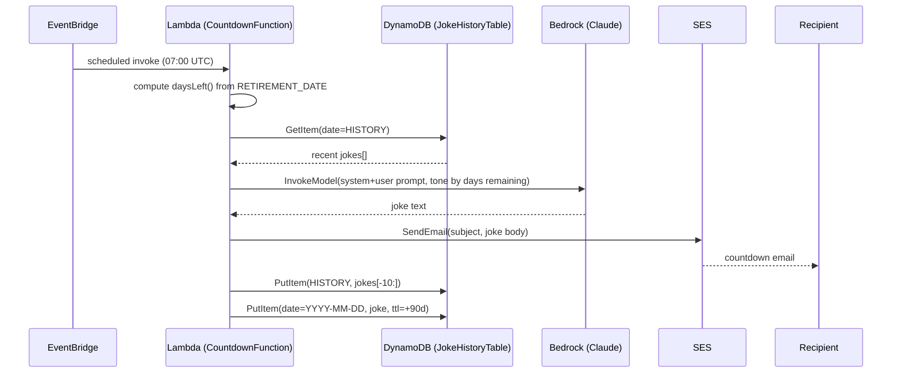
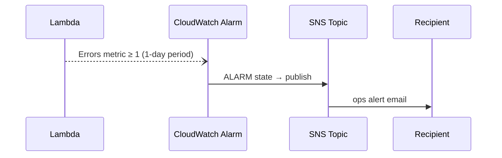

# Architecture

## Overview

`retirement-calleth` is a single-purpose, event-driven serverless application
defined as one AWS CDK stack (`RetirementCountdownStack`). There is no
public-facing endpoint — the only trigger is a scheduled EventBridge rule,
and the only outputs are two emails (the daily joke, and an occasional
ops-error alert).

## Components

| Component | AWS Service | Purpose |
|---|---|---|
| `DailyScheduleRule` | Amazon EventBridge (Scheduler rule) | Cron trigger, `07:00 UTC` daily, invokes the Lambda |
| `CountdownFunction` | AWS Lambda (Node.js 20.x, `NodejsFunction`) | Computes days remaining, calls Bedrock, sends email, reads/writes DynamoDB |
| `JokeHistoryTable` | Amazon DynamoDB | Stores recent joke text (rolling list, key `HISTORY`) plus one dated record per day (90-day TTL) |
| Bedrock invocation | Amazon Bedrock Runtime (`InvokeModel`) | Generates the joke text via a Claude foundation model |
| Email delivery | Amazon SES (`SendEmail`) | Sends the daily countdown email to the recipient |
| `FunctionErrorAlarm` | Amazon CloudWatch Alarm | Fires when the Lambda reports ≥1 error in a day |
| `OpsAlertTopic` | Amazon SNS + email subscription | Delivers the CloudWatch alarm notification to the recipient's inbox |

## Request / data flow

Error path (any unhandled exception in the handler):

## Compute and packaging

- `CountdownFunction` uses `aws-cdk-lib/aws-lambda-nodejs`, which bundles
  `lambda/handler.ts` with esbuild at synth/deploy time (no manual build
  step, no committed `dist/`).
- Runtime: Node.js 20.x, 256 MB memory, 30 s timeout — comfortably sized for
  a handler that makes three sequential network calls (DynamoDB read,
  Bedrock invoke, SES send, DynamoDB writes).
- No VPC attachment — the function only talks to AWS service APIs, so it
  runs in the Lambda-managed execution environment with direct access to
  public AWS service endpoints.

## State

`JokeHistoryTable` (DynamoDB, on-demand/`PAY_PER_REQUEST` billing) holds two
item shapes under a single partition key `date`:

- `date = "HISTORY"` — a rolling list of the last 10 joke strings, used as
  negative examples in the Bedrock prompt so jokes don't repeat.
- `date = "YYYY-MM-DD"` — one record per day the function has run
  (`joke`, `ttl`), kept for 90 days via TTL for debugging/audit, then
  automatically deleted.

The table has `RemovalPolicy.DESTROY`, so `cdk destroy` deletes all history
along with the stack — acceptable given the data is low-value and
regenerable.

## Configuration

Stack props (`RetirementCountdownStackProps`) are resolved in
`bin/retirement-countdown.ts` at synth time and passed to the Lambda as
plain (unencrypted-beyond-default) environment variables:

- `RETIREMENT_DATE`, `SENDER_EMAIL`, `RECIPIENT_EMAIL`, `BEDROCK_MODEL_ID`,
  `TABLE_NAME`.

`retirementDate`, `senderEmail`, and `recipientEmail` are personal data, so
they are **not** hardcoded in source — `bin/retirement-countdown.ts` reads
them from CDK context (`app.node.tryGetContext`) and throws before synth if
any is missing, requiring them to be passed with `-c` on every
`synth`/`deploy`/`destroy` invocation (or supplied via a gitignored
`cdk.context.json`). `bedrockModelId` is not personal data and stays
hardcoded as a sensible default.

There is no external config store (SSM/Secrets Manager) — none of these
values are secret, only configuration and low-sensitivity PII (personal
email addresses), and keeping them out of committed source is sufficient.

## IAM

The Lambda's execution role is scoped per-resource by CDK's grant helpers
where possible:

- `jokeHistoryTable.grantReadWriteData(countdownFn)` — read/write limited to
  the one table.
- `bedrock:InvokeModel` — restricted to the specific model ARN
  (`arn:aws:bedrock:<region>::foundation-model/<bedrockModelId>`).
- `ses:SendEmail` / `ses:SendRawEmail` — restricted to the sender identity
  ARN (`arn:aws:ses:<region>:<account>:identity/<senderEmail>`), not the
  destination address (SES has no resource-level ARN for recipients — see
  [threat-model.md](threat-model.md) and
  [well-architected-review.md](well-architected-review.md)).
- Default CloudWatch Logs permissions are attached automatically by
  `NodejsFunction` for the function's own log group.

## Observability

- Lambda execution logs go to CloudWatch Logs (default log group, no
  custom retention set — see Well-Architected review).
- `FunctionErrorAlarm` watches the Lambda `Errors` metric over a 1-day
  period and treats missing data as "not breaching" (so a day with zero
  invocations doesn't false-positive).
- No tracing (X-Ray), custom metrics, or dashboards — reasonable for a
  single daily invocation with a single consumer.

## Deployment model

Single CDK stack, deployed manually via `npx cdk deploy` from a developer
workstation using local AWS credentials. There is no CI/CD pipeline,
staging environment, or automated test suite in this repository.
