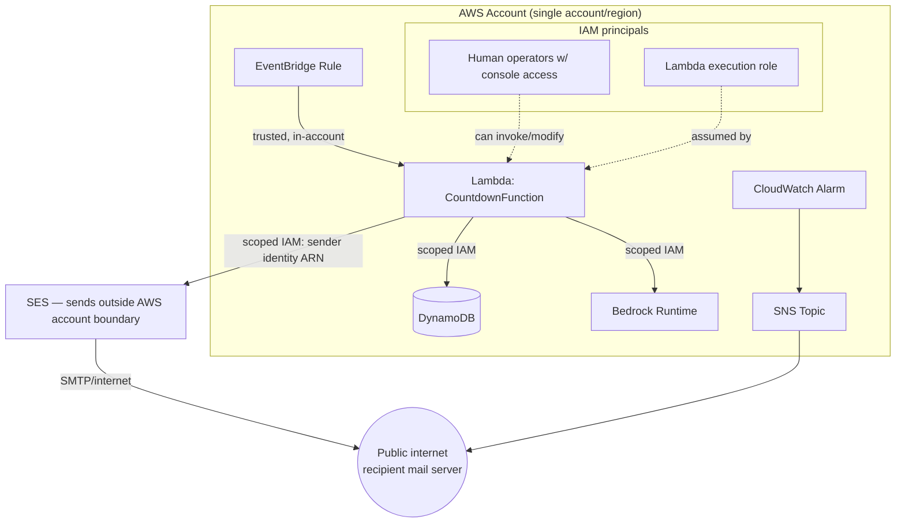

# Threat Model

Methodology: STRIDE, scoped to the deployed AWS resources in
`RetirementCountdownStack` and the code in `lambda/handler.ts`. This is a
personal, single-recipient notification tool with no public network
surface, so the model is sized accordingly — it is not a treatment of a
multi-tenant or internet-facing service.

## Assets

| Asset | Sensitivity | Notes |
|---|---|---|
| Verified SES sender identity | Medium | Reputation asset — abuse could get the sending domain/address flagged as spam |
| Recipient / sender email addresses | Low (PII) | Personal but not sensitive (financial/health) data |
| Lambda execution role credentials | Medium | Scoped IAM permissions to DynamoDB (one table), Bedrock (one model), SES (sender identity ARN) |
| Joke history (DynamoDB) | Low | No sensitive content; regenerable |
| Retirement date | Low | Personal but not sensitive |
| Bedrock/SES usage (cost) | Low | Small per-invocation cost; abuse ceiling is low but non-zero |

## Trust boundaries

Key boundary crossings:
1. **EventBridge → Lambda**: fully inside AWS, IAM-mediated, no external
   input — not attacker-reachable.
2. **Lambda → SES → public internet**: the only place data leaves AWS's
   trust boundary as an email to a real inbox.
3. **Any IAM principal with `lambda:InvokeFunction` in this account →
   Lambda**: the function is invokable by any sufficiently-privileged
   principal in the account, not just the schedule.
4. **Any IAM principal with the Lambda's assumed role → SES**: the SES
   grant is scoped to the sender identity ARN, so anything that can act as
   this role can send email *as that specific verified identity* — but
   still to any recipient address, since SES has no resource-level ARN for
   the destination (see T1).

## Threats by STRIDE category

### Spoofing

- **T1 — Email sent as verified sender to arbitrary recipients.**
  `ses:SendEmail`/`ses:SendRawEmail` are now granted on the sender identity
  ARN (`arn:aws:ses:<region>:<account>:identity/<senderEmail>`) rather than
  `resources: ["*"]` (`lib/retirement-countdown-stack.ts`). This closes the
  original gap where a misused role could send as *any* verified identity
  in the account. It does not restrict the *recipient*: anything that can
  assume the Lambda's execution role can still send mail as this one
  sender identity to any address, not just `RECIPIENT_EMAIL`, because SES
  has no resource-level ARN for the destination address. Residual impact:
  sender reputation damage, potential phishing-as-a-trusted-sender, but
  now bounded to this one identity rather than every identity in the
  account. **Further mitigation (optional)**: an application-level check
  in `handler.ts` that only ever calls `SendEmailCommand` with the
  configured `RECIPIENT_EMAIL`, or an SES sending-authorization policy on
  the identity, would close the remaining recipient-side gap — but note
  the code already hardcodes `RECIPIENT_EMAIL` as the sole destination, so
  this only matters if the execution role/credentials are used *outside*
  the shipped handler code.
- **T2 — Spoofed EventBridge invocation.** Not credible: EventBridge rules
  invoke Lambda via IAM (`lambda:InvokeFunction` granted specifically to
  the rule), and Lambda validates the invoking principal. No mitigation
  needed beyond default IAM behavior.

### Tampering

- **T3 — DynamoDB history tampering.** Any principal with write access to
  `JokeHistoryTable` (currently just the Lambda's role, correctly scoped)
  could alter joke history. Impact is negligible — worst case is a
  repeated joke. No action needed.
- **T4 — Source/dependency tampering (supply chain).** The Lambda is
  bundled by esbuild from `lambda/handler.ts` and its npm dependencies
  (`@aws-sdk/*` packages) at deploy time, with no lockfile integrity check
  or CI build step in this repo. A compromised transitive dependency could
  run arbitrary code with the Lambda's IAM permissions (i.e., could exploit
  T1). **Mitigation**: `package-lock.json` is already committed (good —
  pins versions); consider `npm ci` in a CI pipeline plus periodic
  `npm audit`/Dependabot to catch known-vulnerable versions.
- **T5 — Configuration tampering.** `bin/retirement-countdown.ts` is
  plain committed source with no protected/reviewed deploy path (no CI,
  no required PR review enforced by tooling). Anyone with write access to
  the repo and deploy credentials could redirect `recipientEmail` or swap
  `bedrockModelId`. Acceptable for a single-owner personal repo; would
  need branch protection + required review if the repo gains
  collaborators.

### Repudiation

- **T6 — Limited audit trail for SES sends.** CloudTrail logs the
  `SendEmail` *management*-plane call (who/when), which is sufficient here.
  There's no non-repudiation requirement beyond "did the job run" — the
  CloudWatch alarm plus Lambda logs already cover that. No action needed.

### Information Disclosure

- **T7 — Email addresses and joke content in CloudWatch Logs.** The
  handler doesn't explicitly log addresses or joke text, but any unhandled
  exception could include them in a stack trace written to CloudWatch Logs.
  Log group has no explicit retention/access restriction beyond default
  IAM (`logs:*` scoped to the function's own log group by
  `NodejsFunction`'s default role). Low impact (low-sensitivity PII), but
  worth noting log retention is unset (see Well-Architected review).
- **T8 — Environment variables readable by any principal with
  `lambda:GetFunctionConfiguration`.** `RECIPIENT_EMAIL`/`SENDER_EMAIL` are
  stored as plain (not KMS-encrypted-with-CMK) Lambda environment
  variables. Anyone in the account with that read permission can see them
  via console/CLI. Low sensitivity data, default AWS-managed encryption at
  rest already applies — proportionate as-is.
- **T9 — Real email addresses committed to source control.** If this
  repository is or becomes public, `bin/retirement-countdown.ts` containing
  real addresses would expose them. **Mitigation**: keep placeholder
  values in the tracked file for a public repo; supply real values via
  CDK context (`-c recipientEmail=...`) or a gitignored local override
  file if the repo's visibility changes.

### Denial of Service

- **T10 — Invocation-triggered cost abuse.** No component here is
  internet-facing, so external DoS isn't applicable. The only DoS-adjacent
  risk is an in-account principal with `lambda:InvokeFunction` calling the
  function repeatedly to run up Bedrock/SES usage costs. Low likelihood
  (requires existing IAM access to the account) and low impact (costs are
  fractions of a cent per call). **Mitigation (optional)**: a
  Lambda reserved-concurrency limit of 1 would cap parallel abuse without
  affecting normal (once-daily, non-concurrent) operation; a budget alarm
  (see Well-Architected review) catches cost anomalies regardless of cause.
- **T11 — Legitimate daily run blocked by throttling.** Bedrock on-demand
  throughput or SES sending limits could throttle a run. The
  `FunctionErrorAlarm` catches this after the fact (email alert); there's
  no automatic retry. Acceptable given impact is "missed one joke email."

### Elevation of Privilege

- **T12 — Execution-role scope is now tight across all three grants.**
  DynamoDB and Bedrock grants are scoped to specific resources
  (`grantReadWriteData` on one table; `bedrock:InvokeModel` on one model
  ARN), and the SES grant is scoped to the sender identity ARN (T1) rather
  than `resources: ["*"]`. The residual gap — a compromised execution
  context can still send to any recipient as this one identity, since SES
  has no destination-side ARN — is noted in T1 as optional further
  hardening, not an open elevation-of-privilege path across identities.
- **T13 — No resource-based policy restricting who can invoke the
  Lambda beyond the EventBridge rule.** By default, only principals
  explicitly granted `lambda:InvokeFunction` (the EventBridge rule, plus
  whatever IAM policies exist elsewhere in the account) can invoke it —
  this is standard IAM-default-deny behavior, not a stack-specific gap.

## Risk summary

| ID | Threat | Likelihood | Impact | Priority |
|---|---|---|---|---|
| T1/T12 | SES send-as scoped to one identity, but still any recipient (residual, post-fix) | Low | Low (bounded to the one sender identity) | Low — optional hardening |
| T4 | Unaudited dependency supply chain, no CI | Low | Medium | Medium |
| T9 | Real email addresses in committed source if repo goes public | Depends on repo visibility | Low | Medium (situational) |
| T7/T8 | Low-sensitivity PII visible via logs/env vars to in-account principals | Low | Low | Low |
| T10/T11 | Cost abuse or throttling of a once-daily job | Low | Low | Low |
| T3/T5/T6/T13 | Standard IAM-default-deny behavior already mitigates these | — | — | No action |

## Recommended actions, in order

1. ~~Scope `ses:SendEmail`/`ses:SendRawEmail` to the sender identity ARN
   instead of `"*"`~~ — **done** (closed T1/T12's cross-identity risk; see
   [well-architected-review.md](well-architected-review.md)).
2. If/when the repo becomes public, replace real email addresses in
   `bin/retirement-countdown.ts` with placeholders and move real values to
   CDK context or a gitignored override (closes T9).
3. Optional hardening: reserved concurrency of 1 on the Lambda (T10), CI
   with `npm audit`/Dependabot (T4), explicit CloudWatch log retention
   (T7), and an application-level recipient check to close T1's residual
   any-recipient gap.
